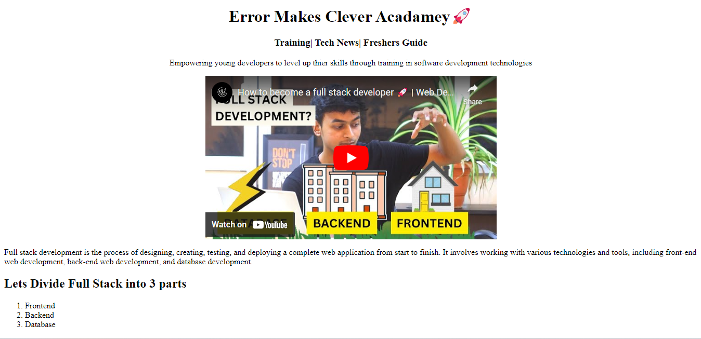

# EMC Page Project

## Introduction

The EMC (Electronic Medical Records) Page project is a simple web application built using HTML. It provides a basic platform for storing and managing electronic medical records. This project is ideal for educational purposes or as a starting point for further development of a full-fledged medical records system.

## Features

- **User-Friendly Interface:** The project includes a straightforward user interface for easy navigation and data entry.
- **Patient Records:** Store and manage patient information, including names, ages, contact details, and medical histories.
- **Search Functionality:** Quickly search for specific patient records based on various criteria.
- **Basic Security:** While this project is primarily educational, it includes basic security measures to protect patient data.

## Getting Started

1. Clone the repository to your local machine.
2. Open the `index.html` file in your web browser.
3. Start adding and managing patient records.

## Usage

- Add new patient records by filling out the provided form.
- Search for existing patient records by using the search functionality.

## Contributing

Contributions are welcome! If you'd like to contribute to this project, please follow the guidelines outlined in [CONTRIBUTING.md](link_to_contributing.md).

## License

This project is licensed under the [MIT License](link_to_license.md). See the [LICENSE.md](link_to_license.md) file for more details.

## Contact

If you have any questions or suggestions, please feel free to reach out to [Your Name](mailto:your@email.com).

---

Make sure to replace the placeholders with actual links, names, and contact information. Additionally, you can customize the description to include any specific details or features of your EMC page project.
